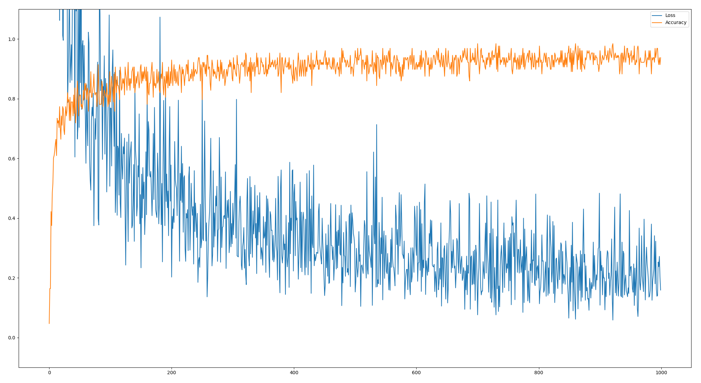
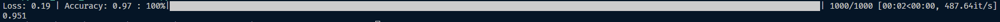

# Python MNIST classifier

    
    

This program allows a user to build a classifier to recognise numbers in images, based on an MNIST dataset.

95.1% accuracy is achieved with the current neural network after training the classifier.

# Dataset

The MNIST dataset used in this program can be found at:

http://yann.lecun.com/exdb/mnist/train-images-idx3-ubyte.gz

http://yann.lecun.com/exdb/mnist/train-labels-idx1-ubyte.gz

http://yann.lecun.com/exdb/mnist/t10k-images-idx3-ubyte.gz

http://yann.lecun.com/exdb/mnist/t10k-labels-idx1-ubyte.gz

# Contribution

If you'd like to contribute to `python_mnist_classifier` please submit a pull-request on a feature branch.

# Installing

Clone the repo:

    git clone https://github.com/Sommos/python_mnist_classifier

    cd python_mnist_classifier
